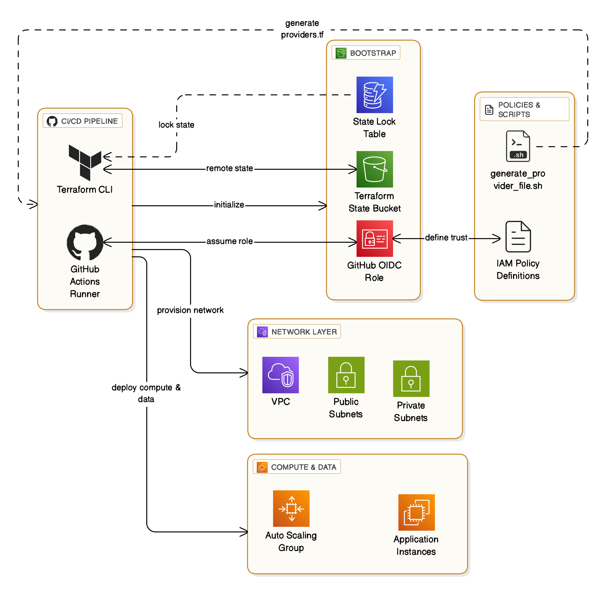

# Terraform Blue-Green Infrastructure Deployment on AWS

This repository provides a fully automated Terraform-based solution for deploying and managing AWS infrastructure across multiple environments (`staging` and `production`). It leverages Terraform workspaces, modular code architecture, and GitHub Actions for CI/CD automation, following the **Blue-Green deployment strategy** to enable zero-downtime rollouts.

---

## Architecture Overview

The infrastructure is organized into modular components to ensure scalability, reusability, and ease of maintenance:

- **Bootstrap**: Sets up backend components (S3, DynamoDB) and configures GitHub OIDC trust for secure CI/CD.
- **Network Module**: Provisions VPC, subnets, internet/NAT gateways, route tables, security groups, and an Application Load Balancer (ALB).
- **Environment Module**: Deploys EC2 instances via Auto Scaling Groups, configures RDS and Redis, and attaches necessary IAM roles and `user_data` scripts.
- **CloudWatch Module**: Manages metrics, alarms, dashboards, log groups, and log filters for EC2, RDS, and Redis.
- **Policies & Scripts**: Includes IAM policy JSONs and shell scripts for connectivity testing, dynamic provider setup, and more.

---

---

## Getting Started

### Step 1: Bootstrap Initialization

Before deploying any environment, you must initialize the backend and GitHub OIDC trust setup:

```bash
make deploy-bootstrap
```

This will:
- Create an S3 bucket and DynamoDB table for storing remote Terraform state.
- Generate backend configuration files under the `outputs/` directory.
- Set up an IAM role with OIDC trust for GitHub Actions.
- Dynamically generate `providers.tf` for CI/CD execution.

To tear down the bootstrap resources:

```bash
make delete-bootstrap
```



---

### Step 2: Environment Deployment Using Workspaces

Each environment (`staging`, `production`) is mapped to a dedicated Terraform **workspace**, enabling isolated deployments with shared code but environment-specific configurations.  
The workspace selection and switching are **fully automated by the CI/CD pipeline**, so you don’t need to manage it manually.

To apply the configuration manually (if needed):

```bash
terraform workspace select staging || terraform workspace new staging
```

Then apply the configuration:

```bash
terraform apply -auto-approve
```

---

## GitHub Actions Workflow

The CI/CD pipeline is defined in `.github/workflows/main.yml`.

### Trigger Parameters:

- **Environment**: `staging`, `production`, or `both`
- **Action**: `apply` or `destroy`

### Pipeline Steps:

1. Set up Terraform with a pinned version.
2. Authenticate via GitHub OIDC and assume the appropriate IAM role.
3. Select or create the environment workspace.
4. Initialize and validate the configuration.
5. Format and lint Terraform files.
6. Apply or destroy infrastructure as requested.

---

## Connectivity Test 

Connectivity tests validate communication between deployed components (e.g., EC2 ↔ RDS/Redis), IAM-based authentication, and internet access:

```bash
-------------------2025-05-28 02:53:20-----------------------
== START CONNECTIVITY TEST ==

SSM Shell Environment Diagnostics:
User: root
Home:

Testing RDS Port...
✅ RDS port 3306 is reachable

Testing Redis Port...
✅ Redis port 6379 is reachable

Testing IAM-based MySQL Authentication...
✅ IAM RDS auth succeeded

Testing Internet Access...
✅ EC2 instance has internet access

== END CONNECTIVITY TEST ==
```

---

## Utility Scripts

- `scripts/generate_provider_file.sh` – Dynamically generates provider configurations from bootstrap outputs.
- `scripts/user_data.sh.tmpl` – Template for EC2 initialization scripts.

---

## Directory Structure

```
infra_redesign_auto/
├── .github/
│   └── workflows/
│       └── main.yml
├── bootstrap/
│   ├── backend_setup/
│   ├── oidc/
│   │   └── policies/
├── modules/
│   ├── cloudwatch/
│   ├── environment/
│   └── network/
├── policies/
├── scripts/
├── terraform.auto.tfvars
├── main.tf
├── variables.tf
├── outputs.tf
├── locals.tf
├── providers.tf
└── Makefile
```

---

##  AWS Cost Estimation

This infrastructure may incur charges depending on region and usage.

### Key Resources Affecting Cost:

| Component        | Cost Driver                  | Notes |
|------------------|------------------------------|-------|
| S3 & DynamoDB     | Storage and read/write units | Used for state backend |
| EC2              | Instance type and hours       | Controlled via ASG |
| RDS              | Instance type and storage     | Use free tier options if eligible |
| Redis (ElastiCache) | Instance type               | Not included in free tier |
| CloudWatch Logs  | Ingestion + retention         | Monitor logs and use filters |


---

## License

This project is licensed under the [MIT License](LICENSE).

---

##  Maintainer

**Fekri Saleh**  
Cloud Architect & DevOps Engineer  

